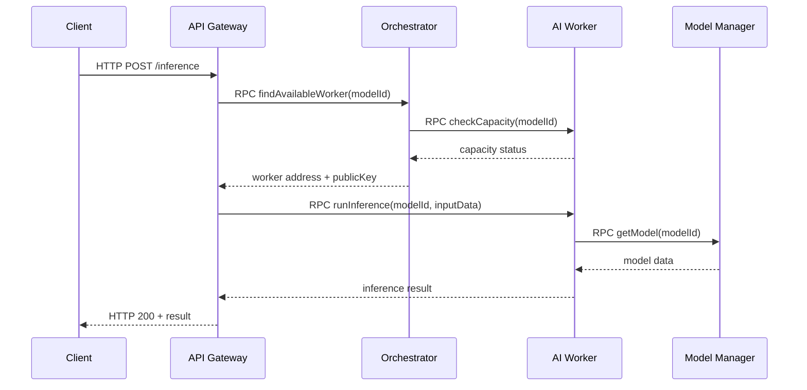
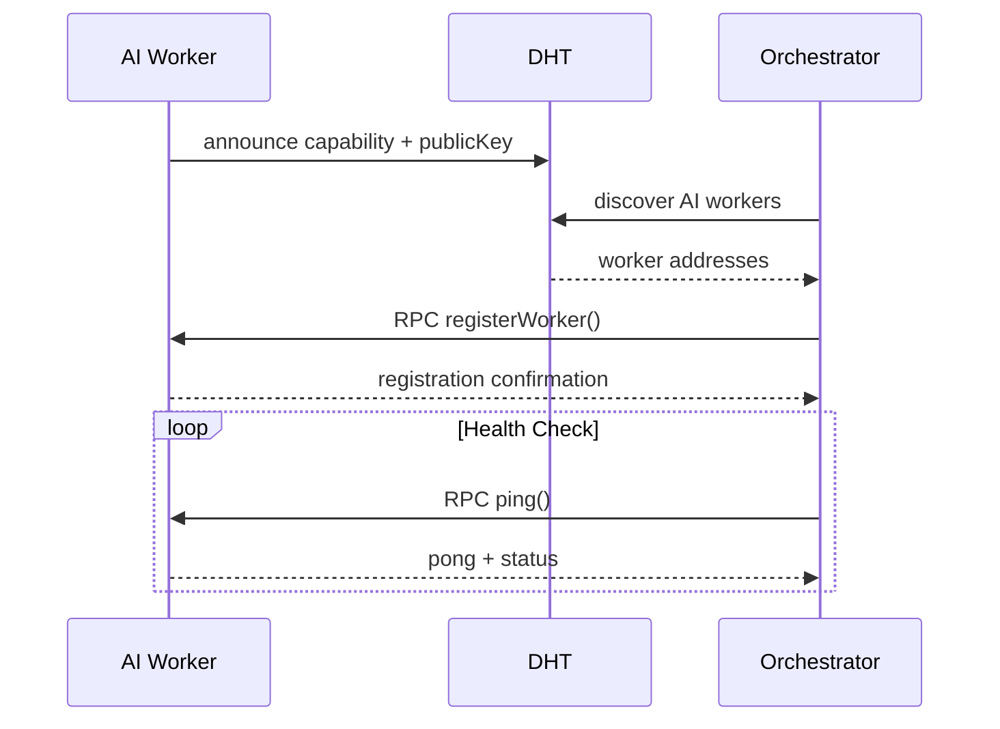

# Tether AI Platform - System Design

## Overview

The Tether AI Platform is a microservice-based architecture designed to provide AI inference capabilities as a service. The system enables users to make inference requests over Hyperswarm RPC, with a focus on scalability, fault tolerance, and distributed processing.

## Architecture Components

### Core Services

1. **API Gateway (wrk-api-gateway)**
   - Port: 8000
   - Handles HTTP requests from external clients
   - Converts HTTP requests to Hyperswarm RPC calls
   - Implements authentication and rate limiting
   - Routes requests to the orchestrator

2. **Orchestrator (wrk-orchestrator)**
   - Port: 8002
   - Service discovery and load balancing
   - Health monitoring and failover management
   - Request routing to available AI workers
   - Maintains service registry

3. **AI Inference Worker (wrk-ai-inference)**
   - Ports: 8001, 8003, 800N (scalable)
   - Executes AI model inference locally
   - Model loading and caching
   - Batch processing capabilities
   - Performance monitoring

4. **Model Manager (wrk-model-manager)**
   - Port: 8004
   - Model storage and distribution
   - Versioning and updates
   - Replication management
   - Metadata management

## System Architecture Diagram

```
┌─────────────────────────────────────────────────────────────────────────────────┐
│                                CLIENT LAYER                                    │
│  ┌─────────────────┐    ┌─────────────────┐    ┌─────────────────┐            │
│  │   Web Client    │    │  Mobile App     │    │   API Client     │            │
│  └─────────────────┘    └─────────────────┘    └─────────────────┘            │
└─────────────────────────────────────────────────────────────────────────────────┘
                                            │
                                      HTTP REST API
                                            │
┌─────────────────────────────────────────────────────────────────────────────────┐
│                                API LAYER                                       │
│                    ┌─────────────────────────────────┐                        │
│                    │        API Gateway              │                        │
│                    │     (wrk-api-gateway)           │                        │
│                    │         Port: 8000              │                        │
│                    │  • Authentication & Rate Limit  │                        │
│                    │  • HTTP to RPC Conversion      │                        │
│                    │  • Request Routing              │                        │
│                    └─────────────────────────────────┘                        │
└─────────────────────────────────────────────────────────────────────────────────┘
                                            │
                                    Hyperswarm RPC
                                            │
┌─────────────────────────────────────────────────────────────────────────────────┐
│                            ORCHESTRATION LAYER                                 │
│                    ┌─────────────────────────────────┐                        │
│                    │        Orchestrator             │                        │
│                    │     (wrk-orchestrator)          │                        │
│                    │         Port: 8002              │                        │
│                    │  • Service Discovery            │                        │
│                    │  • Load Balancing               │                        │
│                    │  • Health Monitoring            │                        │
│                    │  • Failover Management          │                        │
│                    └─────────────────────────────────┘                        │
└─────────────────────────────────────────────────────────────────────────────────┘
                                            │
                                    Service Discovery & Load Balancing
                                            │
┌─────────────────────────────────────────────────────────────────────────────────┐
│                            AI PROCESSING LAYER                                 │
│  ┌─────────────────┐    ┌─────────────────┐    ┌─────────────────┐            │
│  │   AI Worker 1   │    │   AI Worker 2   │    │   AI Worker N   │            │
│  │wrk-ai-inference │    │wrk-ai-inference │    │wrk-ai-inference │            │
│  │   Port: 8001    │    │   Port: 8003    │    │   Port: 800N    │            │
│  │ • Model Loading │    │ • Model Loading │    │ • Model Loading │            │
│  │ • Inference     │    │ • Inference     │    │ • Inference     │            │
│  │ • Caching       │    │ • Caching       │    │ • Caching       │            │
│  └─────────────────┘    └─────────────────┘    └─────────────────┘            │
└─────────────────────────────────────────────────────────────────────────────────┘
                                            │
                                      Model Requests
                                            │
┌─────────────────────────────────────────────────────────────────────────────────┐
│                              STORAGE LAYER                                     │
│                    ┌─────────────────────────────────┐                        │
│                    │        Model Manager            │                        │
│                    │     (wrk-model-manager)         │                        │
│                    │         Port: 8004              │                        │
│                    │  • Model Storage & Distribution │                        │
│                    │  • Versioning & Updates         │                        │
│                    │  • Replication Management        │                        │
│                    │  • Metadata Management          │                        │
│                    └─────────────────────────────────┘                        │
│                                    │                                           │
│                    ┌───────────────┼───────────────┐                          │
│                    │               │               │                          │
│            ┌─────────────┐ ┌─────────────┐ ┌─────────────┐                   │
│            │ Hypercore  │ │ Hyperbee    │ │ Local Cache │                   │
│            │(Model Files)│ │(Metadata)   │ │(Active Data)│                   │
│            └─────────────┘ └─────────────┘ └─────────────┘                   │
└─────────────────────────────────────────────────────────────────────────────────┘
                                            │
                                    Service Discovery
                                            │
┌─────────────────────────────────────────────────────────────────────────────────┐
│                              NETWORK LAYER                                     │
│                    ┌─────────────────────────────────┐                        │
│                    │      Hyperswarm DHT             │                        │
│                    │    (Service Discovery)          │                        │
│                    │  • Peer Discovery               │                        │
│                    │  • Capability Announcement      │                        │
│                    │  • Health Status Tracking       │                        │
│                    │  • Automatic Failover           │                        │
│                    └─────────────────────────────────┘                        │
└─────────────────────────────────────────────────────────────────────────────────┘
```

## User Flow Diagrams

### Inference Request Flow

### Service Registration Flow


## Service Discovery and Communication

### Hyperswarm RPC Communication

The platform uses Hyperswarm RPC for inter-service communication, providing:

- **Decentralized Service Discovery**: Services automatically discover each other through the Hyperswarm DHT
- **Capability-Based Routing**: Services announce their capabilities (model types, processing power)
- **Health Monitoring**: Continuous health checks and automatic failover
- **Load Distribution**: Intelligent routing based on service capacity and current load

### Communication Flow

1. **Client Request**: HTTP request to API Gateway
2. **Authentication**: API Gateway validates credentials and applies rate limiting
3. **Service Discovery**: API Gateway discovers available orchestrator instances
4. **Request Routing**: Orchestrator finds optimal AI worker based on load and capabilities
5. **Model Loading**: AI worker loads required model from Model Manager if not cached
6. **Inference Execution**: AI worker processes the request locally
7. **Response Routing**: Response flows back through orchestrator to API Gateway
8. **Client Response**: HTTP response sent to client

## Data Storage and Replication

### Model Storage Architecture

- **Hypercore**: Stores large binary model files with built-in replication
- **Hyperbee**: Stores model metadata, versioning information, and configuration
- **Local Cache**: Active models cached on AI workers for fast access

### Replication Strategy

- **Model Files**: Replicated across multiple Model Manager instances
- **Metadata**: Synchronized across all Model Manager instances
- **Cache Invalidation**: Automatic cache updates when models are updated
- **Versioning**: Support for multiple model versions with rollback capabilities

## Scalability and Robustness

### Horizontal Scaling

- **AI Workers**: Can scale horizontally by adding more worker instances
- **Load Balancing**: Orchestrator distributes load across available workers
- **Model Manager**: Multiple instances for redundancy and performance
- **API Gateway**: Can be replicated behind a load balancer

### Fault Tolerance

- **Service Health Monitoring**: Continuous health checks for all services
- **Automatic Failover**: Failed services are automatically removed from routing
- **Graceful Degradation**: System continues operating with reduced capacity
- **Data Consistency**: Hypercore/Hyperbee ensure data consistency across failures

### Data Sharding

- **Model Partitioning**: Models distributed across multiple Model Manager instances
- **Request Sharding**: Inference requests distributed based on model type and load
- **Geographic Distribution**: Services can be deployed across multiple regions

## AI Model Execution

### Local Model Execution

- **Model Loading**: Models loaded into memory on AI workers
- **Caching Strategy**: Frequently used models kept in memory
- **Batch Processing**: Multiple requests processed together for efficiency
- **Resource Management**: Memory and CPU usage monitoring

### Supported Model Types

- **ONNX Models**: Cross-platform neural network models
- **PyTorch Models**: Native PyTorch model support
- **TensorFlow Models**: TensorFlow model execution
- **Custom Models**: Support for custom model formats

## Security Considerations

### Authentication and Authorization

- **API Key Management**: Secure API key generation and validation
- **Rate Limiting**: Protection against abuse and DoS attacks
- **Service Authentication**: Inter-service authentication using Hyperswarm keys

### Data Protection

- **Model Encryption**: Sensitive models encrypted at rest
- **Secure Communication**: All inter-service communication encrypted
- **Access Control**: Fine-grained access control for model access

## Performance Optimization

### Caching Strategies

- **Model Caching**: Frequently used models cached on workers
- **Response Caching**: Similar requests cached for faster response
- **Metadata Caching**: Model metadata cached for quick lookups

### Load Balancing

- **Round Robin**: Basic load distribution
- **Weighted Round Robin**: Based on worker capacity
- **Least Connections**: Route to worker with fewest active connections
- **Health-Based**: Route only to healthy workers

## Monitoring and Observability

### Metrics Collection

- **Service Metrics**: CPU, memory, and network usage
- **Request Metrics**: Latency, throughput, and error rates
- **Model Metrics**: Model loading time, inference time, and accuracy

### Logging

- **Structured Logging**: JSON-formatted logs for easy parsing
- **Log Aggregation**: Centralized log collection and analysis
- **Error Tracking**: Comprehensive error logging and alerting

## Deployment Architecture

### Development Environment

- **Local Development**: All services run locally for development
- **Docker Support**: Containerized deployment for consistency
- **Hot Reloading**: Development mode with automatic service restart

### Production Environment

- **Kubernetes**: Container orchestration for production
- **Service Mesh**: Istio for advanced traffic management
- **Monitoring**: Prometheus and Grafana for metrics and alerting
- **Logging**: ELK stack for log aggregation and analysis

## Future Enhancements

### Planned Features

- **GPU Support**: CUDA and OpenCL support for GPU acceleration
- **Model Streaming**: Streaming large models for memory efficiency
- **Federated Learning**: Distributed model training capabilities
- **Multi-Tenancy**: Support for multiple organizations and users

### Scalability Improvements

- **Edge Computing**: Deploy workers closer to users
- **Model Compression**: Quantization and pruning for smaller models
- **Predictive Scaling**: Auto-scaling based on demand patterns
- **Global Distribution**: Multi-region deployment for low latency